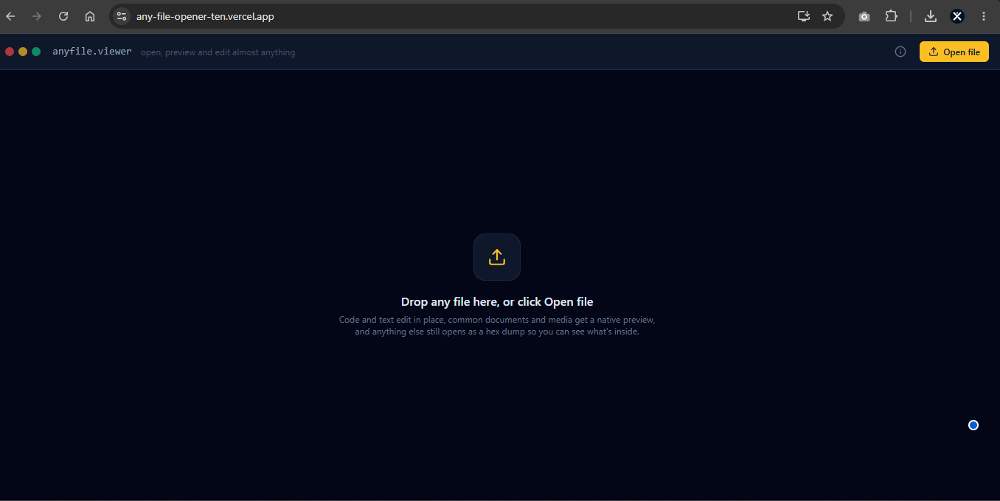
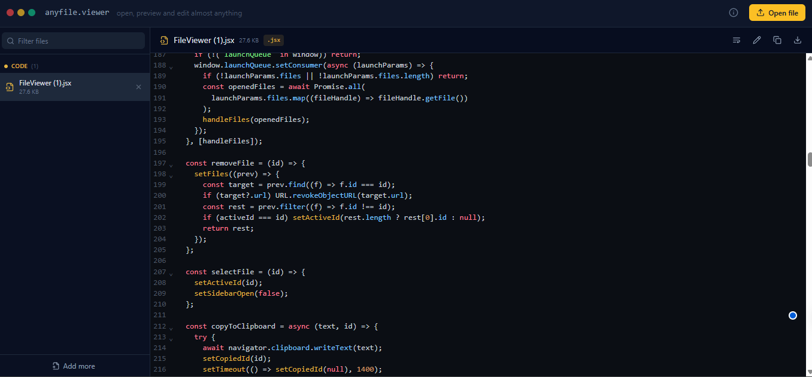
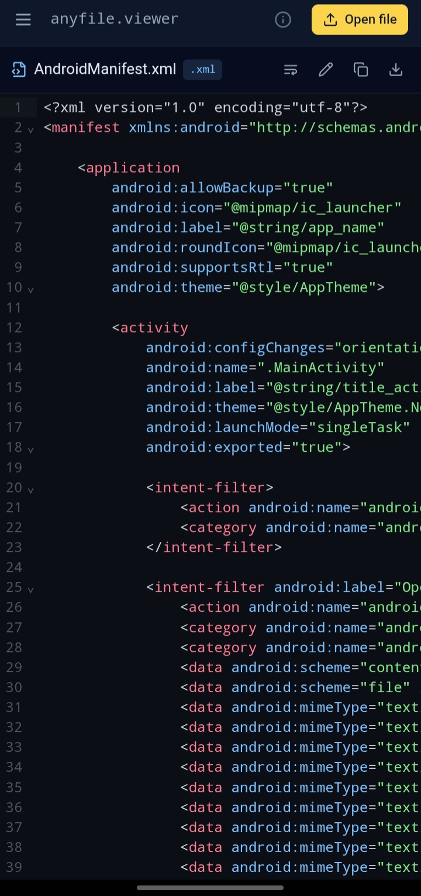
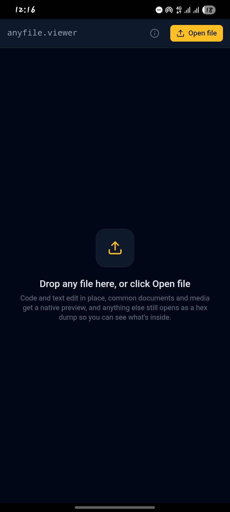

<div align="center">

# AnyFile Viewer

**Open, preview, and edit almost any file type — entirely on your device.**

No uploads. No backend. No account. No ads. Your files never leave your machine.

[](LICENSE)
[]()
[]()
[]()

[**Live Demo**](https://any-file-opener-ten.vercel.app/) · [**Download Android APK**](https://github.com/Xcelsama/Any-file-opener/releases/download/App/AnyFile.Viewer.-.v1.0.apk) · [Report a Bug](../../issues) · [Request a Feature](../../issues)

</div>

---

<details>
<summary><strong>📸 Screenshots (click to expand)</strong></summary>
<br>

<div align="center">




</div>

</details>

## Download

| Platform | Link |
|---|---|
| 🌐 Web | [any-file-opener-ten.vercel.app](https://any-file-opener-ten.vercel.app/) |
| 📱 Android (APK) | [**Download latest APK**](https://github.com/Xcelsama/Any-file-opener/releases/download/App/AnyFile.Viewer.-.v1.0.apk) |
| 💻 Desktop PWA | Install directly from the web link above (Chrome/Edge → install icon in the address bar) |

> The Android APK is not on the Play Store yet — you'll need to allow "install from unknown sources" the first time. This is a self-signed debug build; nothing in it phones home or requests unnecessary permissions.

## Why this instead of a generic "online file viewer"

Most web-based file viewers upload your file to a server to process it, then show you ads while you wait. AnyFile Viewer doesn't:

| | Typical online file viewer | AnyFile Viewer |
|---|---|---|
| Where your file goes | Uploaded to a server, often kept for a while | Never leaves the browser — File API only |
| Ads / tracking | Usually both | Neither |
| Editing | View-only | Live in-place editing for code, JSON, Markdown, CSV |
| Works offline | No | Yes, after first load (service worker) |
| Format detection | Extension-based | Extension **plus** magic-byte signature detection — flags files whose content doesn't match their name |

You can verify the privacy claim yourself: open the app, turn off wifi, and it still works.

## Features

- **317 recognized file extensions** across code, documents, spreadsheets, images, audio, video, archives, fonts, email, and more
- **Magic-byte format detection** — identifies the real file type from its binary signature, not just the extension, and flags mismatches (e.g. a `.png` renamed to `.txt`); also peeks inside zip-based files to correctly recognize a `.docx`/`.xlsx`/`.epub` even if it's misnamed as a plain `.zip`
- **File metadata** — dimensions for images/video, duration for audio/video, entry counts for archives, last-modified date, shown right under the toolbar
- **Client-side image conversion** — save any previewable image as PNG, JPEG, or WebP, no upload round-trip
- **Live code editing** with syntax highlighting for 40+ languages (via CodeMirror)
- **Zero backend** — every file is read directly via the browser's File API and processed client-side
- **Installable** as a PWA on desktop, or a native Android app with OS-level "Open with" file-handler support
- **Offline-capable** — service worker caches the app shell after first load
- **Safe by default** — untrusted HTML content (`.docx`, Markdown) is sanitized before render; oversized files are rejected before they can freeze the tab

<details>
<summary><strong>Full list of what renders natively</strong></summary>

| Type | Rendering |
|---|---|
| Code & text | Syntax-highlighted, in-place editable |
| JSON | Editable + one-click formatter |
| Markdown | Rendered view with raw/edit toggle |
| Images | Native preview (png, jpg, gif, webp, svg, avif, heic, tiff, ...) + convert to PNG/JPEG/WebP |
| PDF | Inline viewer |
| Word (.docx) | Converted to sanitized, readable HTML |
| Excel / CSV / ODS | Spreadsheet table view |
| Audio / Video | Native players, duration shown |
| Fonts (ttf, otf, woff, woff2) | Live specimen preview |
| Archives (zip, jar, war, epub) | Contents listing, no extraction needed, EPUB title detection |
| Email (.eml) | Parsed header + body |
| Everything else recognized | "No preview" card with download button |
| Unrecognized | Magic-byte sniffed first, then auto-detected as text (editor) or binary (hex dump) |

</details>

## Tech stack

- **Framework:** Next.js 14 (App Router)
- **Styling:** Tailwind CSS
- **Editor:** CodeMirror 6
- **Parsing:** `xlsx`, `papaparse`, `mammoth`, `jszip` — all dynamically imported on demand
- **Native shell:** Capacitor (Android)

## Getting started

```bash
git clone https://github.com/Xcelsama/Any-file-opener.git
cd Any-file-opener
npm install
npm run dev
```

Open [http://localhost:3000](http://localhost:3000).

## Deployment

Zero-config on [Vercel](https://vercel.com) — no server routes, no environment variables required.

```bash
npx vercel
```

## Building the Android app

The `android/` directory contains a ready-to-build Capacitor project.

```bash
npx cap sync android
npx cap open android
```

Then, in Android Studio: **Build → Generate App Bundles or APKs → Generate APKs**. Set `server.url` in `capacitor.config.ts` to your deployed URL before building.

## Project structure

```
app/            Next.js routes and global styles
components/     UI components (viewer, editor, previews)
hooks/          Platform-bridging hooks (PWA + native file handling)
lib/            File classification, magic-byte detection, parsing helpers, safety limits
android/        Native Capacitor Android project
```

## Contributing

Pull requests are welcome. For major changes, please open an issue first to discuss what you'd like to change.

1. Fork the repo
2. Create your branch (`git checkout -b feature/thing`)
3. Commit your changes
4. Push and open a PR

## License

[MIT](LICENSE) — free to use, modify, and distribute.

---

<div align="center">
Built by <a href="https://github.com/Xcelsama">Xcelsama</a>
</div>
